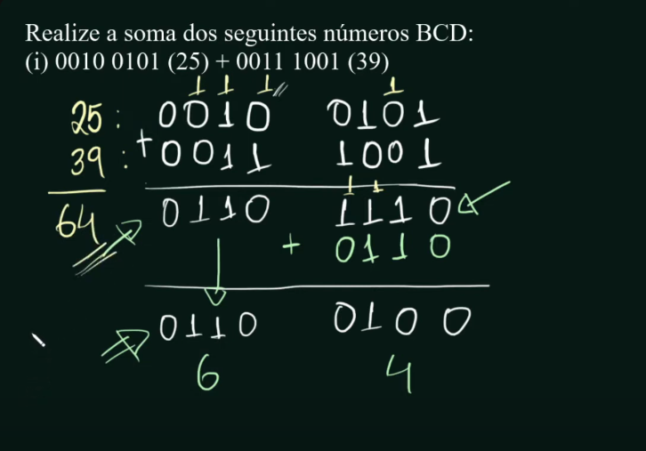
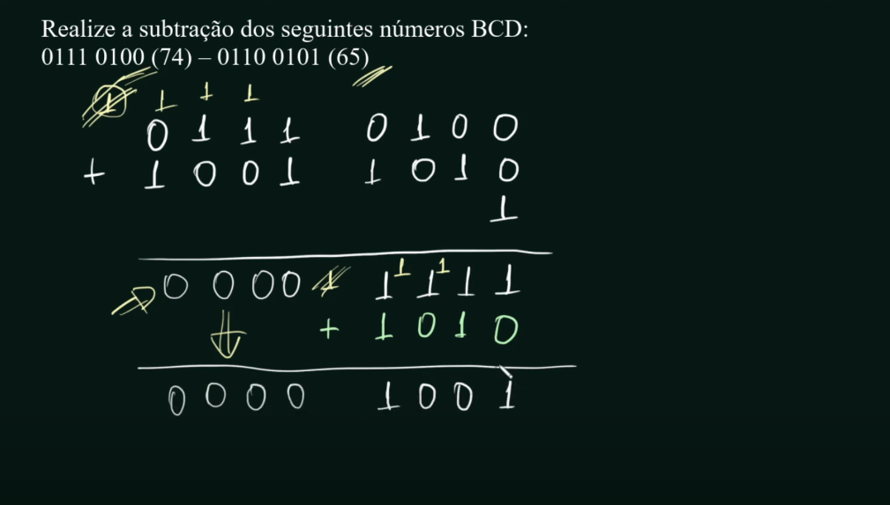

# Aritmética BCD

## Referência dessa página

[Aritmética de Números BCD](https://youtu.be/i48FGijMVO0?si=-86I7q07nqYSjnJ2)
<iframe width="560" height="315" src="https://www.youtube.com/embed/i48FGijMVO0?si=-86I7q07nqYSjnJ2" title="YouTube video player" frameborder="0" allow="accelerometer; autoplay; clipboard-write; encrypted-media; gyroscope; picture-in-picture; web-share" referrerpolicy="strict-origin-when-cross-origin" allowfullscreen></iframe>

## Sobre o código BCD

Alguns sistemas usam, como calculadoras por exemplo.

- Operações de soma e subtração são semelhantes ao binário

Mas o BCD não possui códigos acima de 1001(9), então precisa adaptar os dígitos pra que entrem nesse sistema.

## Adição de números BCD

Faz a soma de cada dígito, da direita para a esquerda, assim como o binário.

Se o resultado for maior que 9 (1001), então deve-se somar o atual com 6 (0110), de forma que o dígito vai voltar pro escopo de 0-9.

Mesmo que o resultado da soma esteja entre 0 e 9, caso seja gerado o vai-um pro dígito da esquerda, deve-se fazer a correção, como no caso de 1001 + 1000.

## Subtração de números BCD

Realiza o complemento de 1 (inverter bit-a-bit) do subtraendo (segundo número)

Realizar a soma dos dois números + 1

Se a operação do bit mais significante NÃO gerar um vai-um, deve-se somar o resultado a 1010(2) 

