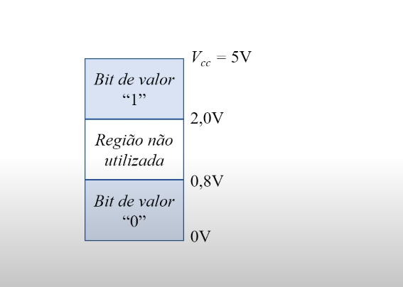
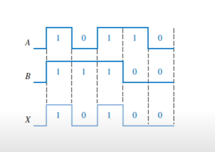
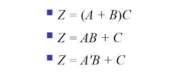
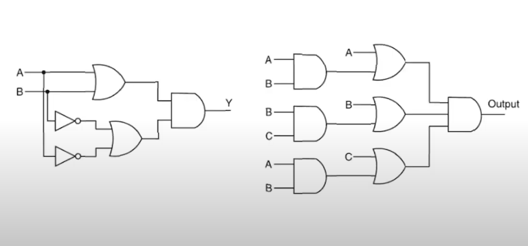

# Ferramentas de Descrição de Circuitos Digitais

## Referência dessa página

[Aula 09 - Ferramentas de Descrição de Circuitos Digitais](https://youtu.be/jzR0kYsay2U?si=9j7aiRSRFH5Vx6PK)
<iframe width="560" height="315" src="https://www.youtube.com/embed/jzR0kYsay2U?si=HxuypzSijgza5UyK" title="YouTube video player" frameborder="0" allow="accelerometer; autoplay; clipboard-write; encrypted-media; gyroscope; picture-in-picture; web-share" referrerpolicy="strict-origin-when-cross-origin" allowfullscreen></iframe>

## Relações Algébricas

Como nos circuitos digitais só existem sinais binários, é necessário estabelecer uma relação lógica entre eles. Para isso, é necessário a Álgebra Booleana, proposta por George Boole, que estabelece relações lógicas entre variáveis que possuem como valores apenas VERDADEIRO e FALSO.

Com esses conceitos, dá pra fazer a relação do bit 1 como VERDADEIRO e 0 como FALSO na eletrônica digital. 

No circuito digital, as entradas podem ser:

### Físicas

Desse modo, o bit "1" tem 2,0V ~ 5V e o "0" tem 0V ~ 0,8V,. Existe também uma região não utilizada, que tem como valor 0,8V ~ 2,0V

### Lógicas

Aqui, o bit com valor "1" pode ser chamado de VERDADEIRO, Ligado, Alto, Sim ou Chave fechada e o bit "0" pode ser chamado de Falso, Desligado, Baixo, Não ou Chave aberta.

PS: as definições não são fixas, depende do projetista do circuito e o que ele quer fazer.

## Classes de circuitos digitais

- Circuito combinacional: Quando a saída depende só das entradas atuais. No caso, se eu sei os valores das entradas, eu sei qual é o da saída.
- Circuito sequencial: A saída depende das entradas e de valores armazenados, que são chamados de **estados do circuito** (existem elementos de memória internos no circuito)

:::warning Atenção
Um circuito só pode ser combinacional ou sequencial, ou seja, são excludentes.
:::

## Ferramentas de Descrição

São ferramentas para descrever o comportamento de entrada/saída de um circuito digital. Algumas delas são:

- Tabelas da verdade;
- Diagrama de temporização;
- Expressões lógicas de saída;
- Diagrama de circuito lógico;
- Diagrama de transição de estados (não disponível pro combinacional, por não ter estados);
- Tabela de transição de estados (não disponível pro combinacional, por não ter estados);

## Tabela da Verdade 

Lista em tabela todas as combinações de entradas com a saída.

Logo:

Linhas da tabela-verdade = 2^N    -> Sendo N o número de variáveis de entrada

## Diagrama de temporização (Carta de tempo)

Já o diagrama de temporização tem uma relação temporal, isso é, mostra os sinais em linhas com gráfico conforme o tempo, como a imagem abaixo:

No caso, quando A = 1 e B = 1, a saída X é 1. e por aí vai...

É importante quando tem muitas variáveis de entrada, ou quando o comportamento temporal for realmente importante.

## Expressão lógica

São expressões com operadores que descrevem o comportamento. Exemplos:

## Diagrama de Circuito Lógico

É um diagrama que usa símbolos padronizados para a descrição da funcionalidade do circuito. Exemplos:

Detalhe importante: eu tendo qualquer uma dessas representações, eu posso "converter" para a outra, pois são só formas de se mostrar a mesma coisa: o comportamento de um circuito digital dadas as entradas.