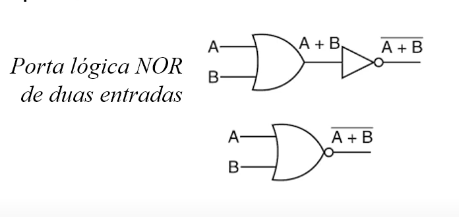
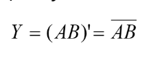
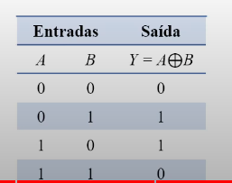

# Funções e Portas Lógicas

## Referência dessa página

[Aula 10 - Funções e Portas Lógicas](https://youtu.be/-4b58LvY6NI?si=2aOfOMx7E7F01L4S)
<iframe width="560" height="315" src="https://www.youtube.com/embed/-4b58LvY6NI?si=g425rzncjycG212h" title="YouTube video player" frameborder="0" allow="accelerometer; autoplay; clipboard-write; encrypted-media; gyroscope; picture-in-picture; web-share" referrerpolicy="strict-origin-when-cross-origin" allowfullscreen></iframe>

## Funções Booleanas

- Or (ou)
- AND (e)
- NOT (não ou inversor)
- NAND (não-e)
- NOR (não-ou)
- XOR (ou-exclusivo ou disjunção)
- XNOR (nou-exclusivo ou coincidência)

Todas essas funções operam sobre entradas binárias e resultam em saídas binárias

## Portas lógicas

Internamente NÃO são componentes eletrônicos, porque são feitas com transistores, mas a efeito de abstração é comum considerar serem componentes eletrônicos.

## Função OR (ou)

É aquela que a saída assume: 

- O valor 1 se pelo menos uma das entradas for 1
- O valor 0 se todas as entradas forem 0

Tabela verdade dadas entradas A e B, e saída Y:

A representação de expressão dessa função é se usando o +, ou seja:

Y = A + B  -> Significa que Y é a saída de **A OU B**

A imagem abaixo é a porta lógica OR, com a representação do circuito eletrônico:

:::warning ATENÇÃO
As portas lógicas e funções lógicas podem receber qualquer número de entradas, mas só podem conter UMA saída.
:::

## Função AND (e)

É aquela que a saída assume:

- O valor 1 se somente TODAS as entradas forem iguais a 1
- O valor 0 se pelo menos uma das entradas for 0

Tabela verdade:

A representação de expressão dessa função é usando . (ou omitindo o ponto), ou seja:

Y = A . B = AB  -> Significa que Y é a saída de **A E B**

## Função NOT (não)

Diferente das outras funções, a NOT possui apenas uma entrada e que a saída assume:

- O valor 1 se a entrada for 0
- O valor 0 se a entrada for 1

Pode se representar essa operação usando ' ou a barra em cima, ou seja:

Y = A' = Ā

:::info
A partir dessas funções já dá pra montar a maioria dos circuitos digitais, mas o povo quis inventar moda e criaram derivações dessas funções.
:::

## Função NOR (nou)

Equivale a fazer a operação NOR com as entradas e depois inverter o resultado. A saída assume:

- O valor 1 quando as duas entradas forem 0
- O valor 0 quando uma das entradas for 1

Na imagem acima, a terceira coluna é uma "pré-operação" (no caso o OR), com o t sendo uma saída provisória.

A forma de expressão de uma função NOR é representada como:

Também pode ser representada colocando (A + B)'.

Na porta lógica, pode-se adicionar a porta OU com a NOT no final ou "mesclar" as duas, colocando o que seria um pontinho para a not.

Assim como mostrado na imagem abaixo:

## Função NAND (não-e)

Equivale a fazer a operação E e depois inverter. Sua saída assume:

- O valor 0 se todas as entradas forem 1
- O valor 1 se uma das entradas for 0

Tabela da verdade:

A forma de expressão de uma função NAND é representada como:

Do mesmíssimo jeito que é feito na porta OR, o processo é feito na porta lógica NAND, colocando uma bolinha pra identificar a inversão.

## Função XOR (disjunção exclusiva)

Opera somente em duas entradas. Sua saída será:

- 1 se as duas entradas forem diferentes
- 0 se as duas entradas forem iguais

A porta lógica XOR é idêntica à do OR, com a única diferença sendo esse risquinho por trás.

## Função XNOR (coincidência)

A saída é:

- 1 se as duas entradas forem iguais
- 0 se as duas entradas forem diferentes

Basicamente, é inverter o XOR, já que o XOR pega duas entradas diferentes.

A representação da expressão da função XNOR podem ser as seguintes:

