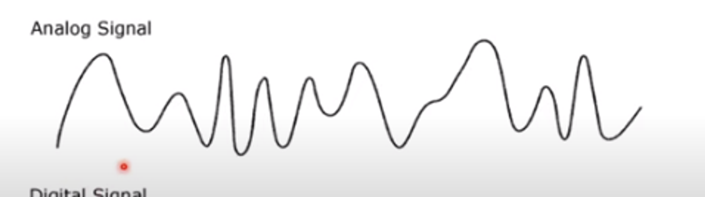
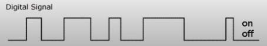
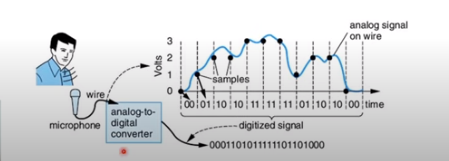
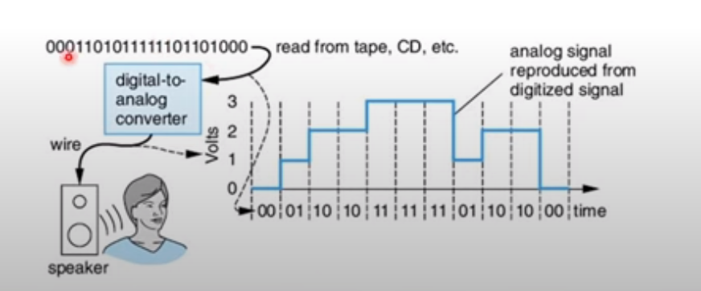

# Introdução

## Referência dessa página

[Introdução aos circuitos digitais](https://youtu.be/1lsU6RoU9Ko?si=8toxIwucTyaRtURt)
<iframe width="560" height="315" src="https://www.youtube.com/embed/1lsU6RoU9Ko?si=ypXB1sgvXdHeyxVa" title="YouTube video player" frameborder="0" allow="accelerometer; autoplay; clipboard-write; encrypted-media; gyroscope; picture-in-picture; web-share" referrerpolicy="strict-origin-when-cross-origin" allowfullscreen></iframe>

## O que é um circuito digital?

Antes de partir para o circuito, é preciso entender os dois tipos diferentes de sinais, analógico e digital

### Sinal Analógico

O sinal analógico assume valores infinitos de amplitude, como se pode ver na imagem acima.

Um exemplo seria a temperatura, onde é representada por vários valores dentro de um intervalo.

### Sinal Digital

Já o sinal digital tem valores finitos de amplitude, como no caso de cima em que só se pode ter 2 estados: ligado e desligado.

::: info
O sinal digital pode ter mais de 2 amplitudes, mas devem ser **OBRIGATORIAMENTE** finitos.
:::

Então, o circuito digital é um circuito eletrônico que recebe como entradas sinais digitais, processa e retorna saídas digitais.

## Onde podemos encontrar circuitos digitais?

- Computadores
- Alguns chips internos de celulares
- Câmeras digitais
- Videogames
- Dispositivos médicos

## Os sinais digitais comuns (sinal binário)

Os sinais digitais comuns bem conhecidos são:

- 1, ligado ou ALTO
- 0, desligado ou BAIXO

Por serem componentes eletrônicos, devem ser representados em forma de onda de tensão, onde o 1 indica +5V e o 0 indica 0

## Vantagens dos circuitos digitais

- São mais fáceis de projetar do que os analógicos (porque o analógico tem muito procedimento matemático complexo)
- O armazenamento da informação é mais simples
- São mais precisos -> Porque são mais imunes aos ruídos
- São mais versáteis (executam mais funções diferentes)
- Costumam ser mais baratos
- Permite a utilização de técnicas avançadas de processamento de sinais -> criptografia e codificação

## Conversão analógico-digital (A/D)

A maioria dos sinais da natureza são analógicos (tem valores infinitos de amplitude)

Então como processar um sinal analógico em um circuito digital? Convertendo!

Vamos mostrar um exemplo utilizando o som (um sinal analógico) que precisa ser captado no nosso circuito digital através de um microfone.

Mas também, na saída eu também quero ouvir a voz processada, que é um sinal analógico - Então convertemos o digital em analógico (*Conversão digital-analógica (D/A)*)

Internamente, esses processos trazem perdas, mas nos sistemas modernos essa perda é muito baixa.
