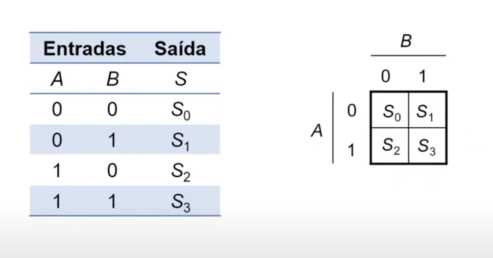

# Mapas de Karnaugh

## Referência dessa página

[Aula 19 - Mapas de Karnaugh](https://youtu.be/8_Ip6PzYqrs?si=QPaTEsV6Mhkwczt2)

<iframe width="560" height="315" src="https://www.youtube.com/embed/8_Ip6PzYqrs?si=QPaTEsV6Mhkwczt2" title="YouTube video player" frameborder="0" allow="accelerometer; autoplay; clipboard-write; encrypted-media; gyroscope; picture-in-picture; web-share" referrerpolicy="strict-origin-when-cross-origin" allowfullscreen></iframe>

## No que consiste?

O mapa de Karnaugh é um método pra diminuir a quantidade de expressões lógicas (simplificação).

É uma representação gráfica da tabela da verdade

Exemplo com duas variáveis:

